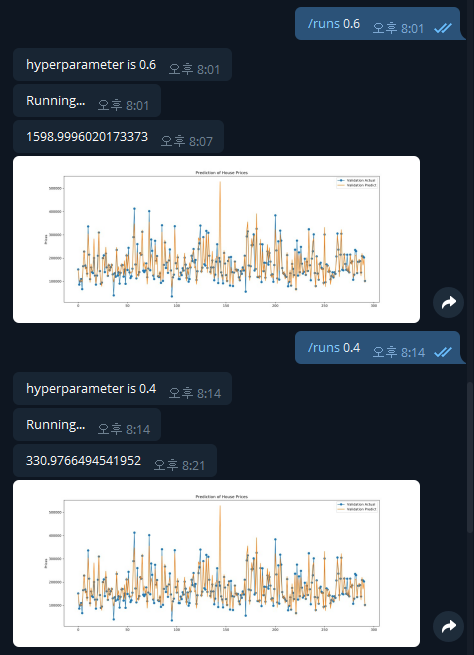

# Telegram-ML-Controller
Control Model Hyperparameter By telegram Message

# Example

# How to Use
Add ML Model code to 'Model'function.
It possibly get hyperparameter from 'handle'function by message.
Its return send to user after it finish its validation.
Also could send figure images by 'snedPhoto' function.

# Update Log
20200301 -init
20200311 -Add Code
